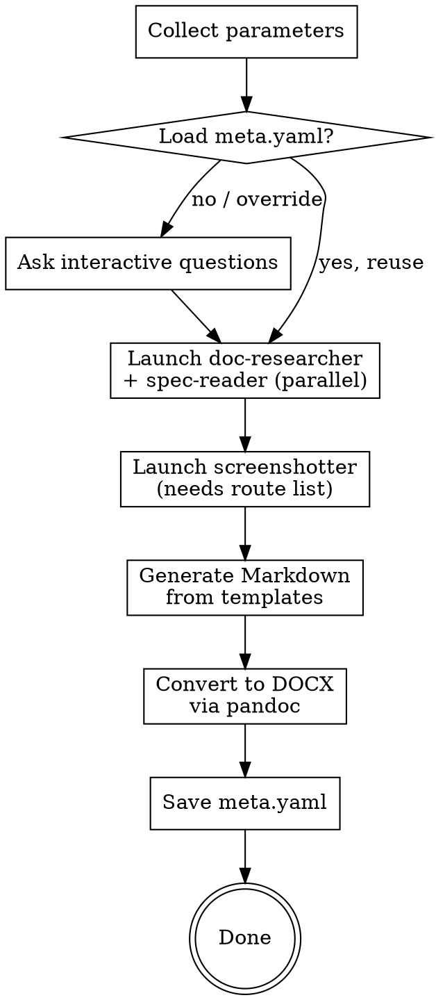

# gen-docs: GOST-Compliant Documentation Generator

Generate formal documentation for information systems with automatic screenshots, following Russian GOST standards (RD 50-34.698-90, GOST 34.201-89, GOST R 59795-2021).

## Overview

This skill orchestrates documentation generation through 4 phases:
1. **Parameter collection** — interactive questions about what to generate
2. **Research** — parallel subagents analyze code and specifications
3. **Markdown generation** — write documents using GOST templates
4. **DOCX conversion** — pandoc with styled reference templates

## Process Flow



## Phase 1: Parameter Collection

Check if `docs/meta.yaml` exists in the project. If yes, offer to reuse previous settings. Otherwise, collect parameters interactively.

### Questions to ask (via AskUserQuestion):

**Q1** (multiSelect): Which documents to generate?
- User Guide (Руководство пользователя)
- Admin Guide (Руководство администратора)
- Operator Guide (Руководство оператора)
- Technical Description (Техническое описание)

**Q2**: GOST compliance mode?
- Strict — full GOST formatting with title page, margins, fonts per GOST 2.105
- Lite — GOST section structure, simplified formatting

**Q3**: Path to codebase?
- Current directory (default)
- Specify manually

**Q4**: Specs/requirements available?
- Yes, path: ___
- No, generate from code only

**Q5**: Application for screenshots?
- Already running at URL: ___
- Launch from Docker (docker compose up)
- Skip screenshots

**Q6** (strict mode only): Title page metadata
- Organization name, system name, document code, version, city

### meta.yaml format

```yaml
project_path: /path/to/project
spec_path: /path/to/specs
doc_types:
  - user-guide
  - admin-guide
gost_mode: strict  # or lite
app_url: http://localhost:3000
app_launch: docker  # or url or none
metadata:
  organization: "Company Name"
  system_name: "System Name"
  doc_code: "CODE.12345-01"
  version: "1.0"
  city: "Moscow"
  year: "2026"
```

## Phase 2: Research with Subagents

### Phase 2a: Parallel Research

Launch TWO agents in parallel using the Agent tool:

**Agent 1: doc-researcher**

Prompt template:
```
You are a documentation researcher. Analyze the codebase at {project_path} and extract ALL information needed for writing formal documentation.

Analyze these sources:
- docker-compose.yml, Dockerfile → services, ports, volumes, architecture
- .env.example, config files → configuration parameters with descriptions
- Routes/controllers → complete list of pages, endpoints, user-facing features
- Models/migrations → database entities and relationships
- Middleware, auth guards → authorization model, user roles
- README, CHANGELOG → system description, version history
- package.json / requirements.txt / go.mod → technology stack

Return a structured Markdown report with these sections:
1. SYSTEM OVERVIEW: name, purpose, tech stack
2. ARCHITECTURE: services, their roles, ports, interactions
3. CONFIGURATION: all parameters from .env/.config with descriptions
4. FEATURES: complete list of user-facing features grouped by module
5. ROUTES/PAGES: all routes with their purpose (for screenshot planning)
6. DATABASE: entities, key fields, relationships
7. AUTH: authentication method, roles, permissions
8. DEPLOYMENT: how to install, run, update

Be thorough. Every detail matters for documentation quality.
```

**Agent 2: spec-reader**

Prompt template:
```
You are a specification analyst. Read all documents in {spec_path} and extract structured information for documentation.

For .md files: read directly.
For .docx files: convert via `pandoc -t plain {file}` and read.
For .pdf files: convert via `pdftotext {file} -` and read.

Extract and return:
1. SYSTEM PURPOSE: official name, designation, purpose statement
2. FUNCTIONAL REQUIREMENTS: numbered list of all functions
3. USER ROLES: list of roles with their permissions
4. BUSINESS PROCESSES: key workflows the system supports
5. CONSTRAINTS: operating conditions, limitations, requirements
6. TERMS: glossary of domain-specific terms

If no spec_path provided, return empty sections with notes that info should come from code analysis.
```

### Phase 2b: Screenshots (after doc-researcher completes)

Use the route/page list from doc-researcher results to build the screenshot config.

**Agent 3: screenshotter**

Prompt template:
```
You are a screenshot automation agent. Your task is to capture screenshots of a running web application for documentation.

Application URL: {app_url}
Application launch: {app_launch}  (if "docker", run `docker compose up -d` in {project_path} first and wait for readiness)

Steps:
1. If app_launch is "docker":
   - Run: cd {project_path} && docker compose up -d
   - Wait up to 60 seconds, polling {app_url} every 3 seconds until it responds

2. Build screenshot config from this route list:
{routes_from_doc_researcher}

3. Run the screenshot script:
   node {skill_path}/scripts/screenshot.js --config <config.json> --output {project_path}/docs/screenshots

4. Verify all screenshots were captured. Report any failures.

5. Return the manifest.json content.

Auth credentials (if needed): {auth_credentials}
```

## Phase 3: Markdown Generation

For each selected document type:

1. Read the appropriate template from `templates/{gost_mode}/{doc_type}.md`
2. Read results from all three subagents
3. Read the screenshot manifest
4. Generate the full Markdown document:
   - Fill every section with real content from research results
   - Insert screenshot references: ``
   - For strict mode: generate title page from `title-page.md` template with metadata
   - Write comprehensive, detailed content — NOT placeholder text
   - All user-facing text in Russian
   - Technical terms and code examples in English

**CRITICAL — Markdown formatting rules:**
- **DO NOT put numbers in headings.** Use `# Введение`, NOT `# 1 Введение`. Pandoc adds section numbers automatically via `--number-sections`.
- **DO NOT use `# Title` then `## Subtitle` as first two headings.** Start directly with `# Введение` as the first section. The document title comes from YAML frontmatter `title:` field.
- **Figure captions:** Use pandoc implicit_figures format: `` — pandoc auto-numbers figures.
- **Table captions:** Place caption BEFORE the table using `: Описание таблицы` syntax (pandoc table caption).
- **All headings in Russian.** No English headings whatsoever.
- **NO horizontal rules.** Do NOT use `---` or `***` as section separators. They create ugly HR lines in DOCX.
- **NO emoji or special Unicode characters.** Do NOT use checkboxes (☑☐), icons, or emoji. Use plain text: `[V] Включено`, `[ ] Выключено`.
- **Bold text sparingly.** Only bold key terms on FIRST mention, button/menu names in instructions, and table header row. Do NOT bold repeated words or phrases already established in context.
- **Table headers:** The first row of every table MUST use bold. This is handled by postprocessing.
- **Table captions:** Place caption BEFORE the table using pandoc syntax: `: Таблица — Описание` on a line by itself before the table.
- **YAML frontmatter** at the top of every generated file:
  ```yaml
  ---
  title: "Название системы. Руководство пользователя"
  lang: ru-RU
  ---
  ```

**Quality requirements for generated content:**
- Each section minimum 200-500 words (except short structural sections)
- Step-by-step instructions must include numbered steps with expected results
- Every screenshot must have a descriptive caption in Russian
- Error handling sections must list specific errors with solutions
- Configuration sections must describe every parameter

Save generated files to `{project_path}/docs/generated/`.

## Phase 4: DOCX Conversion

For each generated Markdown file, run pandoc:

```bash
pandoc \
  --from markdown \
  --to docx \
  --reference-doc={skill_path}/templates/reference-{gost_mode}.docx \
  --toc --toc-depth=3 \
  --number-sections \
  -M lang=ru-RU \
  -M toc-title="Содержание" \
  --resource-path={project_path}/docs/screenshots \
  -o {project_path}/docs/output/{doc_name}.docx \
  {project_path}/docs/generated/{doc_name}.md
```

**Important pandoc flags explained:**
- `-M toc-title="Содержание"` — Russian title instead of "Table of Contents"
- `--number-sections` — automatic section numbering (1, 1.1, 1.2, etc.)
- `-M lang=ru-RU` — Russian language metadata for localization
- `--reference-doc` — applies GOST-compliant styles (fonts, margins, spacing)

**CRITICAL:** The Markdown source MUST NOT contain manual section numbers in headings. Use `# Введение`, NOT `# 1 Введение`. Pandoc `--number-sections` handles all numbering.

After pandoc conversion, run post-processing to fix table borders, cell indents, and figure alignment:

```bash
python3 {skill_path}/scripts/postprocess-docx.py {project_path}/docs/output/{doc_name}.docx
```

For lite mode (Arial font):
```bash
python3 {skill_path}/scripts/postprocess-docx.py {project_path}/docs/output/{doc_name}.docx --font "Arial"
```

Create output directory if it doesn't exist: `mkdir -p {project_path}/docs/output`

After conversion, save `meta.yaml` to `{project_path}/docs/meta.yaml` with all parameters used.

## Template Variables

Templates use these placeholders that the generator replaces:

| Placeholder | Source |
|-------------|--------|
| `{system_name}` | meta.yaml or spec-reader |
| `{system_purpose}` | spec-reader or doc-researcher |
| `{features_list}` | doc-researcher |
| `{routes}` | doc-researcher |
| `{config_params}` | doc-researcher |
| `{db_entities}` | doc-researcher |
| `{auth_model}` | doc-researcher |
| `{user_roles}` | spec-reader |
| `{tech_stack}` | doc-researcher |
| `{screenshots}` | screenshotter manifest |

## GOST Standards Reference

| Standard | What it defines |
|----------|----------------|
| RD 50-34.698-90 | Section structure for AS documentation |
| GOST 34.201-89 | Document types and nomenclature for AS |
| GOST R 59795-2021 | Modern document content requirements |
| GOST 2.105-95 / GOST R 2.105-2019 | Formatting: fonts, margins, numbering |

### Strict mode formatting (per GOST 2.105):
- Font: Times New Roman 14pt (12pt for tables)
- Margins: left 20mm, right 10mm, top 20mm, bottom 20mm
- Line spacing: 1.5
- Page numbers: bottom right
- Headings: bold, separated by blank lines
- Figures: numbered per section (Figure 4.1, Figure 4.2)
- Tables: numbered per section, caption above

## Error Handling

- **App not reachable:** Skip screenshots, generate docs without them, warn user
- **pandoc not found:** Error with install instructions (`brew install pandoc`)
- **Playwright not found:** Error with install instructions (`npm i -g @playwright/test`)
- **pdftotext not found:** Warn, skip PDF specs, suggest `brew install poppler`
- **Docker not running:** Skip docker launch, ask for manual URL
- **Spec path not found:** Warn, continue with code-only analysis

## Output

```
{project_path}/docs/
    generated/          # Markdown sources
        user-guide.md
        admin-guide.md
        operator-guide.md
        technical-description.md
    screenshots/        # Playwright captures
        *.png
        manifest.json
    output/             # Final DOCX files
        user_guide.docx
        admin_guide.docx
        operator_guide.docx
        technical_description.docx
    meta.yaml           # Saved parameters for re-runs
```
