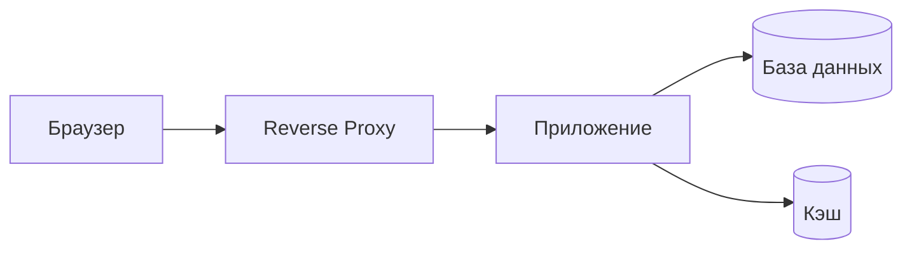

<!-- GOST mode: strict | Template version: 1.1 -->
<!-- Reference: РД 50-34.698-90, ГОСТ Р 59795-2021 -->

# Введение

## Область применения

<!-- AGENT: Describe the scope of this operator guide. The operator is the person responsible for day-to-day system operation: starting, stopping, monitoring, and handling incidents. This is distinct from the administrator (who configures and deploys) and the user (who uses business features). Source: spec-reader SYSTEM PURPOSE + doc-researcher SYSTEM OVERVIEW -->

Настоящий документ является руководством оператора автоматизированной системы «{system_name}» версии {version}.

Документ предназначен для персонала, осуществляющего повседневную эксплуатацию системы: запуск, остановку, контроль состояния и обработку нештатных ситуаций.

## Краткое описание системы

<!-- AGENT: Brief system description from the operator's perspective. Focus on:
1. System purpose (1-2 sentences)
2. Main components that the operator interacts with (services, containers, processes)
3. Key operational characteristics (uptime requirements, maintenance windows)
Source: doc-researcher SYSTEM OVERVIEW + ARCHITECTURE -->

Система «{system_name}» представляет собой многокомпонентное веб-приложение, развёрнутое в среде контейнеризации Docker. Система состоит из следующих основных компонентов:

<!-- AGENT: List each service from docker-compose.yml with its role. Example:
- Веб-приложение (app) — обработка клиентских запросов;
- База данных (db) — хранение данных;
- Кэш-сервер (redis) — кэширование и очереди задач.
-->

# Назначение и описание системы

<!-- AGENT: Detailed system description for the operator. Source: spec-reader + doc-researcher.
MUST include:
1. Business purpose of the system
2. Operational requirements (availability, response time SLAs if known)
3. System component diagram (Mermaid or textual description)
4. Data flow overview (what data enters, is processed, and exits)
5. External dependencies (third-party services, APIs, DNS, mail servers) -->

## Назначение системы

Система «{system_name}» предназначена для автоматизации процессов... .

## Состав системы

<!-- AGENT: Create a component table:
| Компонент | Технология | Порт | Назначение |
Source: doc-researcher ARCHITECTURE + docker-compose.yml analysis.
List every service/container with its technology, exposed ports, and purpose. -->

| Компонент | Технология | Порт | Назначение |
|-----------|-----------|------|------------|
| Веб-приложение | — | — | Обработка бизнес-логики и клиентских запросов |
| База данных | — | — | Хранение данных системы |

## Схема взаимодействия компонентов

<!-- AGENT: Provide a Mermaid diagram showing how components interact:

Source: doc-researcher ARCHITECTURE -->

# Условия выполнения операций

<!-- AGENT: Describe the environment and access requirements for the operator.
Source: doc-researcher DEPLOYMENT.
MUST include:
1. Physical/network access requirements (SSH, VPN, console access)
2. Required operator credentials and permissions
3. Tools the operator needs (Docker CLI, monitoring dashboards, SSH client)
4. Working schedule considerations (maintenance windows, peak hours)
5. Communication channels (escalation contacts, on-call procedures) -->

Для выполнения операций по эксплуатации системы оператору необходимо:

— доступ к серверу по протоколу SSH;

— учётная запись с правами на выполнение команд Docker;

— доступ к панели мониторинга (при наличии);

— контактные данные администратора системы для эскалации инцидентов.

# Повседневные операции

## Запуск системы

<!-- AGENT: Provide complete startup procedure.
Source: doc-researcher DEPLOYMENT + docker-compose.yml.
MUST include:
1. Pre-startup checks (disk space, network, dependencies)
2. Exact commands to start the system
3. Expected startup sequence (which services start first)
4. Startup time estimate
5. How to verify successful startup (health checks, log messages)
6. What to do if startup fails (reference the emergency section) -->

Для запуска системы выполните следующие действия:

1. Подключитесь к серверу по SSH.

2. Перейдите в каталог проекта:
```bash
cd {project_dir}
```

3. Проверьте наличие свободного дискового пространства:
```bash
df -h
```

4. Запустите контейнеры:
```bash
docker compose up -d
```

5. Убедитесь, что все контейнеры запущены:
```bash
docker compose ps
```
Все контейнеры должны иметь статус `Up` или `running`.

6. Проверьте доступность системы:
```bash
curl -f http://localhost:{port}/health
```

## Остановка системы

<!-- AGENT: Provide graceful shutdown procedure.
Source: doc-researcher DEPLOYMENT.
MUST include:
1. Notification to users (if applicable)
2. Graceful shutdown commands
3. Verification that all services stopped
4. Forced shutdown procedure (if graceful fails)
5. Post-shutdown checks (no orphan processes, ports released) -->

Для корректной остановки системы:

1. При плановой остановке уведомите пользователей заблаговременно.

2. Выполните команду остановки:
```bash
docker compose down
```

3. Убедитесь, что все контейнеры остановлены:
```bash
docker compose ps
```
Список должен быть пуст.

4. В случае если контейнер не останавливается, используйте принудительную остановку:
```bash
docker compose kill {service_name}
```

## Контроль состояния

<!-- AGENT: Comprehensive health monitoring guide.
Source: doc-researcher DEPLOYMENT + ARCHITECTURE.
MUST include:
1. Health check commands and expected responses
2. Resource utilization monitoring (CPU, RAM, disk, network)
3. Log monitoring (what to watch for, error patterns)
4. Database connectivity check
5. External service connectivity check
6. Recommended monitoring frequency (continuous, hourly, daily)
7. Alert thresholds and escalation criteria -->

### Проверка состояния контейнеров

```bash
# Статус всех контейнеров
docker compose ps

# Использование ресурсов
docker stats --no-stream
```

### Проверка журналов

```bash
# Журнал приложения (последние 100 строк)
docker compose logs --tail=100 app

# Непрерывный мониторинг журналов
docker compose logs -f app
```

### Критерии нормальной работы

| Параметр | Нормальное значение | Предупреждение | Критическое |
|----------|-------------------|----------------|-------------|
| Загрузка CPU | < 70% | 70–90% | > 90% |
| Использование RAM | < 80% | 80–90% | > 90% |
| Свободное место на диске | > 20% | 10–20% | < 10% |
| Время отклика | < 2 с | 2–5 с | > 5 с |

## Перезапуск системы

<!-- AGENT: Describe restart procedure (combination of stop + start with additional checks).
Include: when restart is needed, hot restart vs cold restart, service-level restart. -->

Для перезапуска системы:

```bash
# Перезапуск всех сервисов
docker compose restart

# Перезапуск отдельного сервиса
docker compose restart app
```

## Операции ввода/вывода данных

<!-- AGENT: Describe data import/export procedures if applicable.
Source: doc-researcher FEATURES (import/export functionality).
MUST include:
1. Supported data formats (CSV, JSON, XML, etc.)
2. Import procedures (commands, UI paths)
3. Export procedures
4. Data validation during import
5. Handling import errors -->

# Аварийные ситуации

## Классификация аварийных ситуаций

<!-- AGENT: Define severity levels for incidents:
1. Критическая — полная недоступность системы
2. Высокая — существенное нарушение работы
3. Средняя — частичное нарушение функциональности
4. Низкая — незначительные отклонения

For each level specify: response time, escalation rules, responsible parties. -->

| Уровень | Описание | Время реакции | Действия |
|---------|---------|---------------|----------|
| Критический | Полная недоступность системы | Немедленно | Немедленное восстановление, уведомление руководства |
| Высокий | Недоступность ключевых функций | 30 минут | Диагностика и устранение, уведомление администратора |
| Средний | Частичное нарушение функциональности | 2 часа | Диагностика, плановое устранение |
| Низкий | Незначительные отклонения | 8 часов | Фиксация в журнале, устранение при возможности |

## Действия при аварийных ситуациях

<!-- AGENT: For each common failure scenario, provide a step-by-step recovery procedure:

1. Контейнер приложения не отвечает
2. База данных недоступна
3. Переполнение дискового пространства
4. Ошибки аутентификации
5. Высокая загрузка сервера
6. Внешний сервис недоступен

Each scenario MUST include:
- Symptoms (how to detect)
- Diagnostic commands
- Recovery steps
- Verification after recovery
- Escalation criteria (when to involve administrator) -->

### Контейнер приложения не отвечает

**Симптомы:** система недоступна по HTTP, health check возвращает ошибку.

**Диагностика:**
```bash
docker compose ps
docker compose logs --tail=50 app
```

**Восстановление:**
```bash
docker compose restart app
```

**Эскалация:** если перезапуск не помог в течение 10 минут, обратитесь к администратору системы.

### База данных недоступна

**Симптомы:** ошибки подключения к базе данных в журнале приложения.

**Диагностика:**
```bash
docker compose ps db
docker compose logs --tail=50 db
```

**Восстановление:**
```bash
docker compose restart db
# Подождите 30 секунд для инициализации БД
docker compose restart app
```

**Эскалация:** если база данных не запускается, обратитесь к администратору для восстановления из резервной копии.

### Переполнение дискового пространства

**Симптомы:** ошибки записи в журналах, система не сохраняет данные.

**Диагностика:**
```bash
df -h
docker system df
```

**Восстановление:**
```bash
# Очистка неиспользуемых образов и контейнеров Docker
docker system prune -f

# Очистка старых журналов
docker compose logs --no-log-prefix app > /dev/null
```

## Журнал учёта аварийных ситуаций

<!-- AGENT: Recommend a format for logging incidents:
| Дата | Время обнаружения | Уровень | Описание | Причина | Принятые меры | Время восстановления |
This is for manual record-keeping by the operator. -->

Оператор обязан фиксировать все аварийные ситуации в журнале по следующей форме:

| Дата | Время обнаружения | Уровень | Описание инцидента | Причина | Принятые меры | Время восстановления |
|------|-------------------|---------|-------------------|---------|--------------|----------------------|
| | | | | | | |

# Взаимодействие со смежными системами

<!-- AGENT: Document all external integrations and dependent services.
Source: doc-researcher ARCHITECTURE + code analysis of external API calls.
For each external system include:
1. System name and purpose of integration
2. Communication protocol (REST API, gRPC, message queue, etc.)
3. Connection parameters (endpoints, ports)
4. Authentication method
5. What happens when the external system is unavailable (graceful degradation?)
6. Monitoring the integration health -->

## Перечень смежных систем

<!-- AGENT: Create a table:
| Смежная система | Протокол | Назначение интеграции | Критичность |
Source: doc-researcher ARCHITECTURE, analysis of HTTP clients, message queue consumers/producers -->

| Смежная система | Протокол | Назначение интеграции | Критичность |
|----------------|----------|----------------------|-------------|

<!-- AGENT: Fill in based on actual integrations found in the codebase -->

## Контроль взаимодействия

<!-- AGENT: How to verify external integrations are working:
1. Health check commands for each integration
2. Expected response patterns
3. Timeout and retry configuration
4. Fallback behavior description -->

Для контроля взаимодействия со смежными системами оператор должен периодически проверять:

— доступность внешних сервисов;

— наличие ошибок в журнале, связанных с внешними вызовами;

— время отклика внешних систем.
