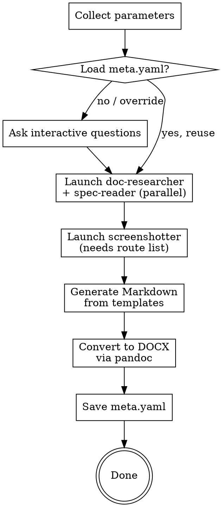

# GOSTDocs: GOST-Compliant Documentation Generator

Generate formal documentation for information systems with automatic screenshots, following Russian GOST standards (RD 50-34.698-90, GOST 34.201-89, GOST R 59795-2021). **v0.3.0-dev**

> **Rework in progress.** v0.3 replaces the 4-phase linear flow with a 7-phase graph,
> structured Doc-Model intermediates, and stack-agnostic adapters. See
> [ROADMAP.md](../../ROADMAP.md) at the repository root for the phased plan and
> acceptance criteria. Sections below document the current state — legacy v0.2
> behaviour is kept as a fallback during migration.

## Pipeline (v0.3)

```
0. bootstrap       npm ci in skill sandbox + playwright install chromium
1. precheck        env / app / API / roles / min-entities                blocking
2. research        code + specs + DB schema + openapi                    files + coverage
3. plan-capture    routes x roles x viewports x themes x locales x states x journeys
4. capture         Playwright + API-login + dismiss + actions
5. ui-inspection   vision agent - JSON per screenshot
6. generation      Doc-Model JSON - Markdown - DOCX
7. validation      md-lint + docx-lint + pHash - REPORT.md
```

Each phase reads and writes to disk; any phase can be re-run in isolation via
`--only <phase>`. Research results are cached by input-content hash and reused
across runs unless inputs change.

## Sandbox and dependencies

The skill is self-contained. Runtime dependencies (Playwright + browser) live
under `skills/gostdocs/node_modules/` and `skills/gostdocs/.playwright-cache/`,
installed once by `bootstrap.js`. The skill never relies on globally installed
Playwright or Chromium.

- `scripts/bootstrap.js [--force|--check]` — install/verify sandbox
- `scripts/precheck.js --config <meta.yaml>` — run precheck phase

## UI inspection (Phase 5A)

Every PNG in the capture manifest gets a matching JSON describing the
visible interface. The Phase 6 generator consumes those JSONs to fill the
per-screen checklist (breadcrumb, top buttons, filters, columns, row
actions, modals) rather than guessing from the screenshot alone.

### Disk layout

Mirror of `docs/screenshots/`:

```
docs/screenshots/admin/desktop/ru/home.png
docs/generated/_inspection/admin/desktop/ru/home.json
```

### Subagent contract (vision pass)

After capture, `scripts/ui-inspector.js` iterates every entry in
`docs/screenshots/manifest.json`. Behaviour depends on `vision.provider`:

1. **Claude path (default)** — the script writes a job queue to
   `docs/generated/_inspection/_pending.jsonl`, one row per capture with
   `{ capture, png_path, target_json, prompt }`. The SKILL orchestrator
   iterates the queue and dispatches each row via the `Agent` tool, with
   the agent reading the PNG via the Read tool and writing the result to
   `target_json` using the shape from `inspection-schema.js`.
2. **OpenAI path** — the script calls `adapters/vision/openai.js` directly
   for every row, which POSTs to `https://api.openai.com/v1/chat/completions`
   with the image as a base64 `image_url` content part. Requires
   `OPENAI_API_KEY` in the environment (the script never echoes it).

Results are persisted via `scripts/lib/inspection-store.js`:
`write(projectPath, captureFile, data)`, `listAll(projectPath)` for
Phase 7 reports.

Flip provider at run-time with `--vision-provider claude|openai`; the
choice is only written to `meta.yaml` on the next interactive save.

### Setting up OpenAI vision access

When the user selects `--vision-provider openai`, the orchestrator should:

1. Check `OPENAI_API_KEY` in environment. If unset, prompt for the key and
   instruct the user to `export OPENAI_API_KEY=sk-...` in their shell OR
   pass it via a one-off `OPENAI_API_KEY=sk-... npm run ui-inspector`.
2. Never write the key to `meta.yaml`. Never echo it to logs.
3. On HTTP errors, surface the HTTP status but NOT the request body
   (OpenAI echoes the key in some 4xx responses).

### Red-flag detection

`is_login_form=true` in an authenticated role's JSON marks the shot as a
failed capture. Phase 7 `REPORT.md` surfaces such entries so the user
sees them before opening the DOCX.

## Research and specs (Phase 4)

### Subagent contract

Every research subagent (doc-researcher, spec-reader, schema-adapter,
openapi-adapter, role-discovery, ...) MUST:

1. Write prose output to `docs/generated/_research/<agent>.md` (or several
   topic files — one per logical section).
2. Write a machine-readable `docs/generated/_research/<agent>.summary.json`
   matching the `research-result` schema:
   ```json
   {
     "version": "1.0",
     "agent": "doc-researcher",
     "generated_at": "2026-04-23T12:00:00Z",
     "coverage": [
       { "section": "ROUTES", "found": true, "source": "src/router.ts", "size": 500, "missing": [] },
       { "section": "NFR", "found": false, "source": null, "size": 0, "missing": ["hardware", "load"] }
     ],
     "files": [{ "path": "docs/generated/_research/routes.md", "section": "ROUTES", "bytes": 500 }],
     "warnings": []
   }
   ```
3. Return only a short summary to stdout (title + coverage one-liner). The
   orchestrator reads the full content from disk, not from the agent
   message — this keeps the parent context window small.

### Orchestrator

`scripts/research.js` aggregates every `*.summary.json`, applies the NFR
policy (strict blocks, lite warns), runs the schema adapter and OpenAPI
adapter when their agents did not contribute, and scans `_research/*.md`
for AI-artifact markers. Result: `docs/generated/_research/coverage.json`.

### Schema adapter

`scripts/adapters/schema/index.js` detects Prisma / Alembic / Django /
Knex / TypeORM / Sequelize markers and dispatches to a framework parser.
Only Prisma has a native parser in v0.3; other frameworks return a warning
suggesting `--live-db`, which runs `pg_dump --schema-only` via
`scripts/adapters/schema/pg-dump.js`. All parsers produce the same
normalised shape and are rendered by `scripts/lib/schema-model.js`
`buildMarkdown`.

### OpenAPI / Swagger adapter

`scripts/adapters/openapi.js` loads a local OpenAPI 3.x or Swagger 2.0
spec (`--openapi <path>`), normalises endpoints, and emits a Markdown
section grouped by tag. URL fetching is deferred; the orchestrator is
expected to download a remote spec separately and pass the local path.

### AI-artifact filter

`scripts/lib/ai-artifact-filter.js` flags markdown files whose filename
matches known auto-generated patterns (TECHNICAL_SPECIFICATION.md,
ARCHITECTURE_GUIDELINES.md, GENERATED_*.md) or whose content contains
LLM footers / typical phrasing. Flagged files are not cited by the
Phase 6 generator.

### NFR policy

`scripts/lib/nfr-policy.js` applies the strict-vs-lite decision to
aggregated coverage. In strict mode missing NFR sections emit a
placeholder directive PLUS a validation blocker that stops publication
until the section is filled in. In lite mode the placeholder is still
emitted but publication proceeds with a warning.

## Capture execution (Phase 3B)

`scripts/capture.js` is the v0.3 orchestrator, replacing the legacy monolithic
`screenshot.js`. It consumes `plan.json` and emits a manifest v2 into
`docs/screenshots/manifest.json`.

Per group of tuples that share `(role, viewport, theme, locale)`:
- Auth is prepared via `adapters/auth` (API-login primary, form fallback)
- Post-login `verifyAuth` runs; failure skips the entire group with a
  recorded error in the manifest
- For every tuple:
  1. Parametrized paths are resolved with `id-resolver` — explicit values,
     then `GET <list>?limit=1`, then DOM scrape via `list-scrape.js`
  2. `page.goto` navigates to the substituted URL
  3. `dismiss.applyDismiss` clicks cookie banners / tours (global +
     per-page)
  4. `action-executor` runs `actions[]` if present; each `screenshot: true`
     step produces a separate PNG
  5. Final screenshot is written and a manifest v2 row is upserted

Legacy `screenshot.js` is kept beside `capture.js` until the new path has
been exercised end-to-end on a representative project; migration is
one-directional (new projects use `capture.js` only).

## Capture planning (Phase 3A)

The plan-capture phase turns declarative config into a deterministic list of
capture tuples. Nothing navigates a page until the plan is emitted.

Inputs:
- `pages[]` from `meta.yaml` + routes from research + auto-shots from
  component detector (Builder/Editor/Wizard/Constructor)
- Roles, viewports, themes, locales from `meta.capture.*`
- States (`empty`, `error`, `permission-denied`) only applied to pages that set
  `apply_states: true`
- Journeys from `journeys.yaml` (separate file per architecture decision) —
  each step with `screenshot: true` becomes its own tuple

Output: a flat array under `docs/generated/_captures/plan.json` with one entry
per PNG to be captured. Each entry has a stable `tupleId`, a resolved `file`
path, and every axis value.

Parametrized routes (`/users/:id/edit`, `[id]`, `<int:id>`) are supported by
`scripts/lib/routes.js`. `scripts/adapters/id-resolver.js` emits a fallback
chain per page: explicit `parametrize` values, then `GET <list>?limit=1`,
then DOM scrape of a list page at capture time.

Manifest v2 schema is defined in `scripts/lib/manifest.js`. Filenames follow
`{role}/{viewport}/{theme}/{locale}/{id}{__state}.png` — missing axes
collapse, unsafe characters are sanitised.

## Authentication (Phase 2)

v0.3 prefers API-login over form submission:

- `auth.method: api` performs an HTTP POST to `role.api_endpoint`, extracts a
  token from the response body (configurable `token_key`, otherwise autodetects
  `access_token`, `accessToken`, `jwt`, ...), and seeds the Playwright context
  via `context.addInitScript()` before the first navigation. Cookies set by the
  login response are applied via `context.addCookies()`.
- `auth.storage: auto` detects storage at login time:
  - `set-cookie` present AND body token → `mixed`
  - only `set-cookie` → `cookie`
  - only body token → `localStorage`
- `auth.method: form` remains as fallback and raises a warning in REPORT.md.
- `auth.fallback_to_form: true` retries via form-login when api-login fails.
- `auth.healthcheck_path` is a **blocking** post-login check. After login, a
  page is navigated to the app root; three checks must pass before any
  capture runs for the role:
  1. final URL ≠ login path
  2. token key is present in the configured storage (skipped for cookies)
  3. `GET <healthcheck_path>` returns 2xx (adds `Authorization: Bearer <token>`
     for non-cookie storage)

Role and login-endpoint discovery: `scripts/adapters/role-discovery/scanner.js`
walks the project for seeders, enums, RBAC configs, and router files; returns
deduplicated role candidates + login endpoint candidates with confidence
levels. Output is advisory — users can override via meta.yaml.

Dismiss selectors: `scripts/lib/dismiss.js` clicks configured selectors with a
short visibility window, swallowing failures. Applied after every navigation
and before the screenshot. Merges `auth.dismiss_selectors` (global) with
per-page overrides (Phase 3).

## CLI flags (shared by all entry scripts)

| Flag | Effect |
|---|---|
| `--yes`, `-y` | non-interactive mode, use saved meta.yaml and defaults |
| `--config <path>` | explicit meta.yaml (default: `<project>/docs/meta.yaml`) |
| `--only <name>` | run one phase or one document type |
| `--skip-screenshots` | reuse previously captured screenshots |
| `--rerun-screenshots <role>` | recapture only the listed role (repeatable) |
| `--dry-run` | show operations without writing outputs |
| `--live-db` | allow `pg_dump` / live DB introspection (Phase 4) |
| `--vision-provider <name>` | `claude` (default) or `openai` |
| `--lang <list>` | comma-separated output languages, e.g. `ru,en` |

## Process Flow (v0.2 legacy, still active where v0.3 is not wired)



## Phase 1: Parameter Collection (init-meta flow)

The orchestrator MUST NOT compose `meta.yaml` by hand. Instead it drives
`scripts/init-meta.js`, which scans the project, derives everything it can,
and reports the remaining gaps as a structured list. The orchestrator then
asks the user only about those gaps (one batched `AskUserQuestion` per
≤4 fields, critical first).

### Step 1.1 — Report

```bash
node {skill_path}/scripts/init-meta.js --report --project-path {project_path} > /tmp/init-meta-report.json
```

The JSON envelope:

```json
{
  "proposed_meta": { ... full meta.yaml-shaped object ... },
  "gaps": [
    {
      "field": "metadata.system_name",
      "question": "Как называется система?",
      "header": "System name",
      "default": "ruvents-events",
      "default_source": "package.json name",
      "importance": "high",
      "secret": false
    }
  ],
  "sources": { "db_user": ".env.example", "service_name": "docker-compose.yml", ... },
  "framework": "laravel",
  "routes_count": 12,
  "config_path": "/path/to/docs/meta.yaml"
}
```

Existing `docs/meta.yaml` (if any) is loaded first; values the user already
typed are preserved and never re-asked.

### Step 1.2 — Ask the user (group critical-first, ≤4 per call)

For each gap the orchestrator must:

1. Show the **exact** Russian `question` text.
2. Pre-fill the `default` so the user can confirm with one click.
3. Use a separate `AskUserQuestion` call for `secret: true` gaps
   (passwords, API keys) so they aren't visible alongside other answers.
4. Group remaining gaps into batches of ≤4, sorted by importance
   (critical → high → medium → optional). Use `lib/gap-collector.batchGaps`
   logic if running in JS, or do it manually otherwise.

If the user declines an optional gap (e.g., `metadata.repo_url`), record
the literal string `—` (em dash) so mustache substitutes a stable value
instead of leaving the placeholder visible.

### Step 1.3 — Apply

Write the collected answers as a flat dotted-path map to `/tmp/answers.json`:

```json
{
  "app.url": "http://localhost:5173",
  "metadata.system_name": "RUVENTS Events",
  "metadata.organization": "ООО «РУВЕНТС»",
  "metadata.doc_code": "RVNT.МР.34.01",
  "metadata.version": "1.0",
  "metadata.repo_url": "—",
  "auth.roles[admin].username": "admin@example.com",
  "auth.roles[admin].password": "..."
}
```

Then:

```bash
node {skill_path}/scripts/init-meta.js --apply /tmp/answers.json --project-path {project_path}
```

This writes `docs/meta.yaml` (validated against the v0.3 schema) and adds
it to `.gitignore` automatically.

### What the orchestrator does NOT need to ask

`init-meta --report` already auto-derives the following from the project:

| Field | Source |
|---|---|
| framework | `artisan` / `manage.py` / `package.json` deps (root or `backend/`/`frontend/`) |
| metadata.db_user, db_name, db_host, db_port | `.env.example` / `.env.template` (Laravel/Postgres/MySQL conventions) |
| metadata.service_name | `docker-compose.yml` services (`app`/`web`/`backend`/first) |
| metadata.migration_command, seed_command | Makefile targets > package.json scripts > framework default |
| metadata.port, system_url | parsed from `meta.app.url` |
| metadata.project_dir | basename of `meta.project_path` |
| metadata.repo_url | `git remote get-url origin` (asked only when no remote) |
| metadata.version, organization, responsible | `metadata-autofill` (git tag, `package.json`, git config) |
| pages | `lib/route-discover` (Vue Router, Next.js App Router, Laravel routes/web.php, Django urls.py — root or monorepo subdirs) |
| auth.roles | discovered during research (auth-discovery adapter); credentials always asked |

The only fields that are unconditionally asked: **per-role credentials**
(security), **`metadata.organization`** and **`metadata.doc_code`** (formal
attestation that needs a human), **`metadata.system_name`** (unless
package.json has a name the user accepts).

### Legacy reference: questions to ask (only when init-meta is unavailable)

**Q1** (multiSelect): Which documents to generate?
- User Guide (Руководство пользователя)
- Admin Guide (Руководство администратора)
- Operator Guide (Руководство оператора)
- Technical Description (Техническое описание)

**Q2**: GOST compliance mode?
- Strict — full GOST formatting with title page, margins, fonts per GOST 2.105
- Lite — GOST section structure, simplified formatting

**Q3**: Path to codebase?
- Current directory (default)
- Specify manually

**Q4**: Specs/requirements available?
- Yes, path: ___
- No, generate from code only

**Q5**: Application for screenshots?
- Already running at URL: ___
- Launch from Docker (docker compose up)
- Skip screenshots

**Q5-auth** (shown only when screenshots are NOT skipped):

Ask: *"Does the application have sections that require authentication (login)?"*
- Yes, detect automatically
- No, everything is public → skip to Q6

If "Yes": run probe detection after Phase 2a (doc-researcher) completes and roles are identified.
Then for each detected role, ask:

> "Screenshotter detected the following roles from code analysis: {roles_list}.
> Please provide credentials for each role you want screenshots of (leave blank to skip)."

Collect per role:
- `username` (email or login)
- `password`
- `login_url` (default: `/login`)
- `username_field` CSS selector (leave blank for auto-detect)
- `password_field` CSS selector (leave blank for auto-detect)
- `submit_button` CSS selector (leave blank for auto-detect)

**Security note:** `meta.yaml` is automatically added to the project's `.gitignore`
on first write to prevent credentials from entering version control.

**Q6** (strict mode only): Title page metadata
- Organization name, system name, document code, version, city

### Auto-discovery — what NOT to ask the user for

The skill auto-extracts the bulk of `meta.metadata.*` from the project tree
via `lib/project-introspect.js`. Before falling back to a manual question,
the orchestrator MUST trust the introspect result. Specifically:

| Field | Source (when found) |
|---|---|
| `framework` | `artisan` / `yii` / `bin/console` / `manage.py` / `bin/rails` / `next.config.*` / `nuxt.config.*` / `svelte.config.*` / `package.json` deps |
| `db_user`, `db_name`, `db_host`, `db_port` | `.env.example` / `.env.template` / `.env.dist` (Laravel `DB_DATABASE`/`DB_USERNAME`, Postgres `POSTGRES_*`, MySQL `MYSQL_*`) |
| `service_name` | `docker-compose.yml` services block — first of `app`/`web`/`backend`/`api` or first declared service |
| `migration_command` | `make migrate` (if Makefile) > `npm run migrate` (if package.json scripts) > framework default (`php artisan migrate`, `python manage.py migrate`, `bin/rails db:migrate`, …) |
| `seed_command` | same priority chain |
| `port`, `system_url` | parsed from `meta.app.url` |
| `project_dir` | basename of `meta.project_path` |
| `repo_url` | `git remote get-url origin` inside `meta.project_path` |
| `version`, `organization`, `responsible`, `year` | `lib/metadata-autofill.deriveMetadata` (git tag, `package.json`, git config) |

The orchestrator should run `node scripts/generate.js --config docs/meta.yaml --dry-run` early in the flow purely to collect `[warn] mustache: unresolved {KEY}` messages — those are the ONLY keys the user needs to fill in.

### Q7 — Smart fill-in for whatever is left

After Phase 6 emits its first set of `[warn] mustache:` lines, the orchestrator collects the unique unresolved keys (excluding template-author placeholders like `{role}` / `{Название роли}` which are filled in by writing role-specific prose, not metadata). Then it asks the user via a SINGLE `AskUserQuestion` call (max 4 questions per call — split into multiple calls if needed):

- For `repo_url`: «Укажите URL git-репозитория проекта (или «—», если не используется).»
- For `db_user` / `db_name` / `service_name`: «В вашем `.env.example` / `docker-compose.yml` не найдено значение `<key>`. Введите его.»
- For `migration_command` / `seed_command`: «Команда для применения миграций / заливки начальных данных (если автогенерация ошибочна).»

Each question has a sensible `description` field showing where the skill looked. Answers go straight into `docs/meta.yaml` `metadata:` block via `lib/meta.save`. Then re-run `generate.js` (this time without `--dry-run`).

The user is never asked twice for the same key in one session.

### meta.yaml format (v0.3)

```yaml
skill_version: "0.3.0"
project_path: /path/to/project
spec_path: /path/to/specs
doc_types: [user-guide, admin-guide]
gost_mode: strict   # or lite

app:
  url: http://localhost:3000
  launch: docker    # or url or none

auth:
  method: api       # api | form | none
  storage: auto     # auto | cookie | localStorage | sessionStorage | mixed
  dismiss_selectors: [".cookie-banner", ".intro-tour-dismiss"]
  roles:
    - role: guest
      credentials: null
    - role: admin
      login_url: /login
      api_endpoint: /api/auth/login
      token_key: access_token
      username: admin@example.com
      password: "secret"
      username_field: null        # form-login fallback: null = auto-detect
      password_field: null
      submit_button: null

capture:
  viewports:
    - { name: desktop, width: 1280, height: 800 }
    - { name: mobile,  width: 390,  height: 844 }
  themes: [light, dark]           # optional; empty = skip theme matrix
  locales: [ru, en]                # optional; empty = skip locale matrix
  wait_after_navigation: 2000
  timeout: 30000

states: [empty, error, permission-denied]   # optional states matrix
journeys_file: journeys.yaml                 # optional, relative to project root

precheck:
  health_endpoint: /health
  min_entities: { users: 1, orders: 1 }

output:
  languages: [ru]                 # [ru, en] for multi-language docs
  formats: [docx]

vision:
  provider: claude                # or openai (needs OPENAI_API_KEY)

metadata:
  organization: "Company Name"
  system_name: "System Name"
  doc_code: "CODE.12345-01"
  version: "1.0"
  city: "Moscow"
  year: "2026"
```

**Migration from v0.2:** `scripts/lib/meta.js` auto-migrates older files on load —
`app_url` / `app_launch` become `app.*`; `auth_roles` is wrapped into `auth.roles`
with `method: form` and `storage: cookie` (matching v0.2 behaviour); missing
blocks are initialised with defaults. The migration log is printed to stderr.
Users are never asked to rewrite the file by hand.

## Phase 2: Research with Subagents

### Phase 2a: Parallel Research

Launch TWO agents in parallel using the Agent tool:

**Agent 1: doc-researcher**

Prompt template:
```
You are a documentation researcher. Analyze the codebase at {project_path} and extract ALL information needed for writing formal documentation.

Analyze these sources:
- docker-compose.yml, Dockerfile → services, ports, volumes, architecture
- .env.example, config files → configuration parameters with descriptions
- Routes/controllers → complete list of pages, endpoints, user-facing features
- Models/migrations → database entities and relationships
- Middleware, auth guards → authorization model, user roles
- README, CHANGELOG → system description, version history
- package.json / requirements.txt / go.mod → technology stack

Return a structured Markdown report with these sections:
1. SYSTEM OVERVIEW: name, purpose, tech stack
2. ARCHITECTURE: services, their roles, ports, interactions
3. CONFIGURATION: all parameters from .env/.config with descriptions
4. FEATURES: complete list of user-facing features grouped by module
5. ROUTES/PAGES: all routes with their purpose (for screenshot planning)
6. DATABASE: entities, key fields, relationships
7. AUTH: authentication method, roles, permissions
8. DEPLOYMENT: how to install, run, update

Be thorough. Every detail matters for documentation quality.
```

**Agent 2: spec-reader**

Prompt template:
```
You are a specification analyst. Read all documents in {spec_path} and extract structured information for documentation.

For .md files: read directly.
For .docx files: convert via `pandoc -t plain {file}` and read.
For .pdf files: convert via `pdftotext {file} -` and read.

Extract and return:
1. SYSTEM PURPOSE: official name, designation, purpose statement
2. FUNCTIONAL REQUIREMENTS: numbered list of all functions
3. USER ROLES: list of roles with their permissions
4. BUSINESS PROCESSES: key workflows the system supports
5. CONSTRAINTS: operating conditions, limitations, requirements
6. TERMS: glossary of domain-specific terms

If no spec_path provided, return empty sections with notes that info should come from code analysis.
```

### Phase 2b: Screenshots (after doc-researcher completes)

Use the route/page list from doc-researcher results to build the screenshot config.

**Agent 3: screenshotter**

Prompt template:
```
You are a screenshot automation agent. Your task is to capture screenshots of a running web application for documentation, supporting multiple user roles.

Application URL: {app_url}
Application launch: {app_launch}  (if "docker", run `docker compose up -d` in {project_path} first and wait for readiness)

Steps:
1. If app_launch is "docker":
   - Run: cd {project_path} && docker compose up -d
   - Wait up to 60 seconds, polling {app_url} every 3 seconds until it responds

2. Build screenshot config from this route list:
{routes_from_doc_researcher}

3. Configure auth_roles from meta.yaml credentials:
{auth_roles_from_meta_yaml}
   - Include role "guest" (no credentials) for public pages
   - Include each role that has credentials provided

4. Run the screenshot script:
   node {skill_path}/scripts/screenshot.js --config <config.json> --output {project_path}/docs/screenshots

   Config JSON format:
   {
     "baseUrl": "{app_url}",
     "viewport": {"width": 1280, "height": 800},
     "waitAfterNavigation": 2000,
     "timeout": 30000,
     "pages": [ {routes_as_page_objects} ],
     "auth_roles": [ {auth_roles_array} ]
   }

5. The script automatically:
   - Probes all routes in guest mode to detect which require authentication
   - Runs parallel browser sessions per role
   - Saves screenshots to {project_path}/docs/screenshots/{role}/

6. Verify all screenshots were captured. Report any auth failures.

7. Return the manifest.json content.
```

## Phase 6: Generation (v0.3)

Phase 6 is a deterministic orchestrator — it does NOT fill templates by hand.
The orchestrator reads `templates/gost-{mode}/{doc_type}.md`, expands every
`<!-- GEN:* -->` directive through the adapter map
(schema-model / mermaid / journey-render / security-recommendations / inspection
checklist / metadata autofill), validates the Doc-Model, renders Markdown via
`doc-model-md.render`, runs `md-lint`, and writes
`{project}/docs/generated/{doc-type}.md`.

### CLI
```
node scripts/generate.js --config docs/meta.yaml
node scripts/generate.js --config docs/meta.yaml --only user-guide
node scripts/generate.js --config docs/meta.yaml --dry-run
node scripts/generate.js --config docs/meta.yaml --lang ru,en
```

### Preconditions
- `docs/meta.yaml` valid (v0.3 schema). v0.2 auto-migrates on load.
- `docs/screenshots/manifest.json` present (produced by `capture.js`).
- `docs/generated/_inspection/**/*.json` present (produced by `ui-inspector.js`).
- `docs/generated/_research/coverage.json` + topic `.md` files (from `research.js`).
- For `GEN:db-schema`: `docs/generated/_research/schema.json` (from schema-adapter).
- For `GEN:mermaid`: source block in `docs/generated/_research/<name>.md`
  or standalone `docs/generated/_research/<name>.mmd`.

### GEN:* directive catalog

| Directive | Expander | Effect |
|---|---|---|
| `GEN:metadata key="organization"` | `metadata-autofill.merge` | Paragraph from `meta.metadata` or derived fields |
| `GEN:mermaid source="architecture" title="…"` | `adapters/mermaid.renderToDocModelElement` | PNG figure rendered via local mmdc, centered by postprocess |
| `GEN:db-schema scope="all" headingLevel="3"` | `lib/schema-model.buildMarkdown` | Markdown tables per DB table with FKs + indexes |
| `GEN:endpoints-detail headingLevel="3"` | `adapters/openapi.buildMarkdown` | Per-endpoint documentation (parameters, request body, responses) grouped by tag. Reads `_research/openapi.json` — silent no-op if the research step produced no OpenAPI document |
| `GEN:journey role="user"` | `lib/journey-render.renderJourneysSection` | Numbered step sequences with figures per journeys.yaml |
| `GEN:security-section` | `lib/security-recommendations.buildSection` | Full security recommendations section scoped to docType |
| `GEN:page-description role="user" headingLevel="3"` | `inspection-store` + `lib/page-narrative.buildPageNarrative` | One sub-section per capture: figure + Russian narrative paragraph derived from inspection JSON (`component_kind_notes` + structured action/filter/table/modal sentences). `headingLevel` defaults to **2** so a directive nested under `# Описание операций` renders as `## Page` → numbering `4.1` (not `4.0.1`). The legacy English checklist (`[V] heading: ...`) is no longer emitted into end-user docs. |
| `GEN:pagebreak` | inline | `\pagebreak` (pandoc raw) |
| `GEN:centered-block` / `GEN:end-centered` | inline | Wraps content in `::: {.center}` div |
| `GEN:include template="title-page"` | loads sub-template | Inlines sub-template sections |

Unknown directives log a warning to `ctx.warnings[]` and are dropped.

### Strict vs lite

- **strict**: md-lint errors, missing NFR sections, or unresolved GEN:*
  blockers → `exitCode = 1`. Generation still writes files so the user can
  inspect what is missing before the next run.
- **lite**: every blocker becomes a warning. `exitCode = 0` always.

### Output
`docs/generated/<doc-type>.md` with:
- Doc-Model-emitted figures and tables (auto-numbered per top-level section).
- Auto-numbered headings deferred to pandoc `--number-sections`.
- No LaTeX escape sequences in hand-written paragraphs (use `GEN:pagebreak`).
- Image refs relative to `docs/` (e.g. `screenshots/guest/desktop/home.png`).

### How to add a new GEN directive
1. Add an expander inside `buildExpanders()` in `scripts/generate.js`.
2. Add fixture test cases in `tests/template-loader.test.js` and
   `tests/generate.test.js`.
3. Document it under the catalog above.

## Phase 4: DOCX Conversion

For each generated Markdown file, run pandoc:

```bash
pandoc \
  --from markdown \
  --to docx \
  --reference-doc={skill_path}/templates/reference-{gost_mode}.docx \
  --number-sections \
  --top-level-division=section \
  -M lang=ru-RU \
  --resource-path={project_path}/docs \
  -o {project_path}/docs/output/{doc_name}.docx \
  {project_path}/docs/generated/{doc_name}.md
```

The TOC is NOT generated by pandoc's `--toc` flag: that would force it to
the very top of the DOCX, ahead of the title page. Instead, the generator
emits an explicit `toc` Doc-Model element after the title page, which is
rendered as a raw OpenXML `TOC` field; Word rebuilds it on first open
because `postprocess-docx.py` sets `w:updateFields=true`.

`--resource-path` points at `docs/`, not `docs/screenshots/`, because Doc-Model
emits image refs relative to `docs/` (e.g. `screenshots/...`, `generated/_diagrams/...`).

The postprocess step additionally injects `w:updateFields=true` into
`word/settings.xml`, which makes Word recompute TOC page numbers on first open.

**Important pandoc flags explained:**
- `-M toc-title="Содержание"` — Russian title instead of "Table of Contents"
- `--number-sections` — automatic section numbering (1, 1.1, 1.2, etc.)
- `-M lang=ru-RU` — Russian language metadata for localization
- `--reference-doc` — applies GOST-compliant styles (fonts, margins, spacing)

**CRITICAL:** The Markdown source MUST NOT contain manual section numbers in headings. Use `# Введение`, NOT `# 1 Введение`. Pandoc `--number-sections` handles all numbering.

After pandoc conversion, run post-processing to fix table borders, cell indents, and figure alignment:

```bash
python3 {skill_path}/scripts/postprocess-docx.py {project_path}/docs/output/{doc_name}.docx
```

For lite mode (Arial font):
```bash
python3 {skill_path}/scripts/postprocess-docx.py {project_path}/docs/output/{doc_name}.docx --font "Arial"
```

Create output directory if it doesn't exist: `mkdir -p {project_path}/docs/output`

After conversion, save `meta.yaml` to `{project_path}/docs/meta.yaml` with all parameters used.

## Template authoring (v0.3)

Templates under `templates/gost-{strict|lite}/*.md` define the document
skeleton: YAML frontmatter, heading structure, plain-prose paragraphs, and
`<!-- GEN:* -->` directives at the points where adapters inject content.
Legacy `<!-- AGENT: ... -->` comments — single-line **and** multi-line — are
stripped by the template loader and no longer affect generation. Plain prose
inside a template flows through to the final Markdown unchanged.

### Mustache `{key}` substitution

Templates can use single-brace `{key}` placeholders in plain prose, frontmatter,
and inside fenced code blocks. Before parsing, `lib/mustache-resolve` replaces
each token with `ctx.metadata[key]`:
- known keys (`system_name`, `version`, `port`, `system_url`, `project_dir`,
  …) come from `meta.metadata` plus `lib/metadata-autofill.deriveContextDefaults`
  (port + system_url are parsed from `meta.app.url`, project_dir from
  `meta.project_path`);
- the `metadata` block in `meta.yaml` is now `.passthrough()` — any extra
  string key (`db_user`, `db_name`, `repo_url`, `migration_command`,
  `seed_command`, `service_name`, …) is forwarded verbatim;
- unresolved keys are kept verbatim AND emit a `mustache` warning per
  occurrence (line + filename).
- `${shell}` expansions are NOT touched (negative lookbehind in the regex);
- cyrillic-in-braces (`{Название роли}`) is ignored — the regex only matches
  `[a-z][a-z0-9_]*`;
- code fences with `# Comment` lines are correctly preserved by the loader's
  `fenceMaskedLines` pass — bash comments never split into bogus sections.

### Page-level capture controls

Each entry under `pages:` accepts new optional fields:
- `access_role: guest|guest-only|user|admin|…` — pin a page to one role.
  `buildMatrix()` skips role-page pairs that don't match. Without this field
  the legacy cross-product behaviour applies.
- `query_params: { format: online, sort: -starts_at }` — appended to the URL
  via `lib/interactions.buildUrlWithQuery` so filtered list views can be
  captured without inventing extra page IDs.
- `interactions: [{ action: click|fill|expand|wait_for|wait_ms|scroll, selector, value, ms }]`
  — executed after `page.goto()` and before screenshot. Translated to the
  existing action-executor format by `lib/interactions.interactionsToActionSteps`.
  Use this for FAQ accordion expansion, search field fill, filter buttons.
- `section: public|personal|admin` — informational grouping label, available
  to template authors who want to split `page-description` blocks.

Mustache-style substitutions like `{system_name}` are discouraged — use
`<!-- GEN:metadata key="system_name" -->` so the value travels through the
merged-metadata pipeline.

## GOST Standards Reference

| Standard | What it defines |
|----------|----------------|
| RD 50-34.698-90 | Section structure for AS documentation |
| GOST 34.201-89 | Document types and nomenclature for AS |
| GOST R 59795-2021 | Modern document content requirements |
| GOST 2.105-95 / GOST R 2.105-2019 | Formatting: fonts, margins, numbering |

### Strict mode formatting (per GOST 2.105):
- Font: Times New Roman 14pt (12pt for tables)
- Margins: left 20mm, right 10mm, top 20mm, bottom 20mm
- Line spacing: 1.5
- Page numbers: bottom right
- Headings: bold, separated by blank lines
- Figures: numbered per section (Figure 4.1, Figure 4.2)
- Tables: numbered per section, caption above

## Error Handling

- **App not reachable:** Skip screenshots, generate docs without them, warn user
- **pandoc not found:** Error with install instructions (`brew install pandoc`)
- **Playwright not found:** Error with install instructions (`npm i -g @playwright/test`)
- **pdftotext not found:** Warn, skip PDF specs, suggest `brew install poppler`
- **Docker not running:** Skip docker launch, ask for manual URL
- **Spec path not found:** Warn, continue with code-only analysis

## Output

```
{project_path}/docs/
    generated/          # Markdown sources
        user-guide.md
        admin-guide.md
        operator-guide.md
        technical-description.md
    screenshots/        # Playwright captures — one subfolder per role
        guest/
            *.png
        admin/
            *.png
        user/
            *.png
        manifest.json   # All captures with role + access fields
    output/             # Final DOCX files
        user_guide.docx
        admin_guide.docx
        operator_guide.docx
        technical_description.docx
    meta.yaml           # Saved parameters for re-runs (in .gitignore — contains passwords)
```
